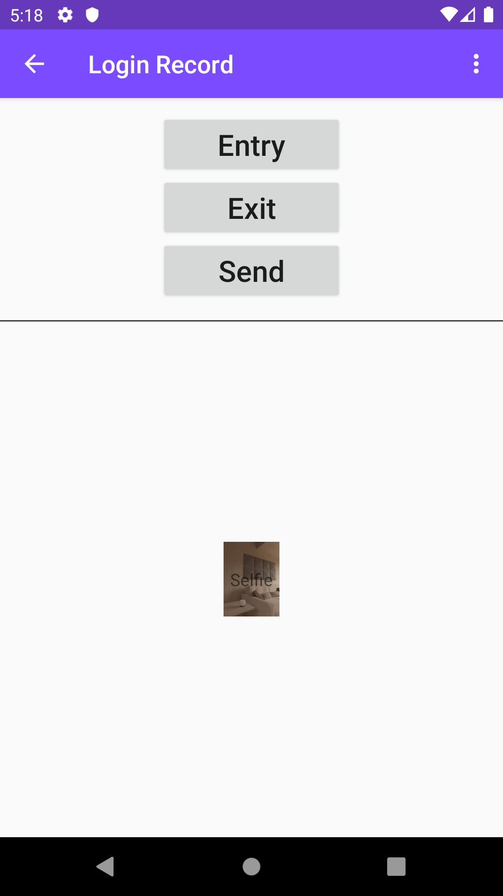
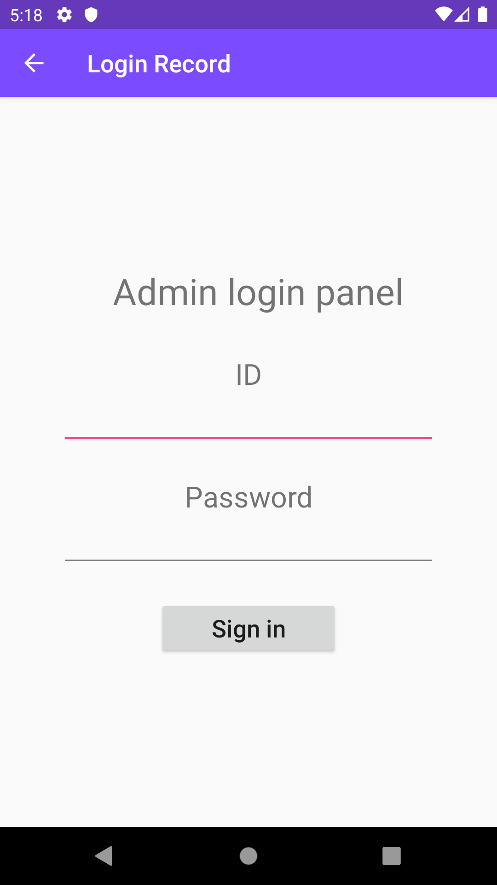
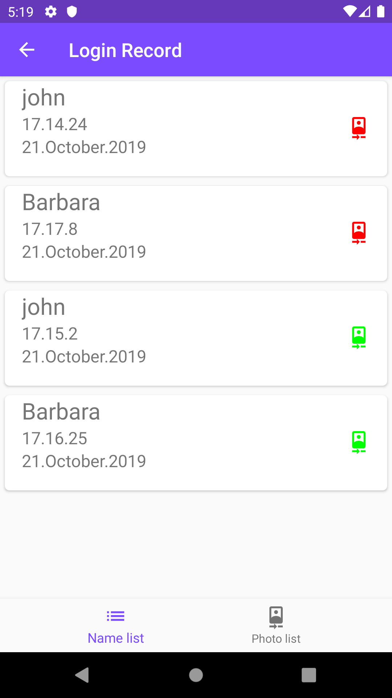
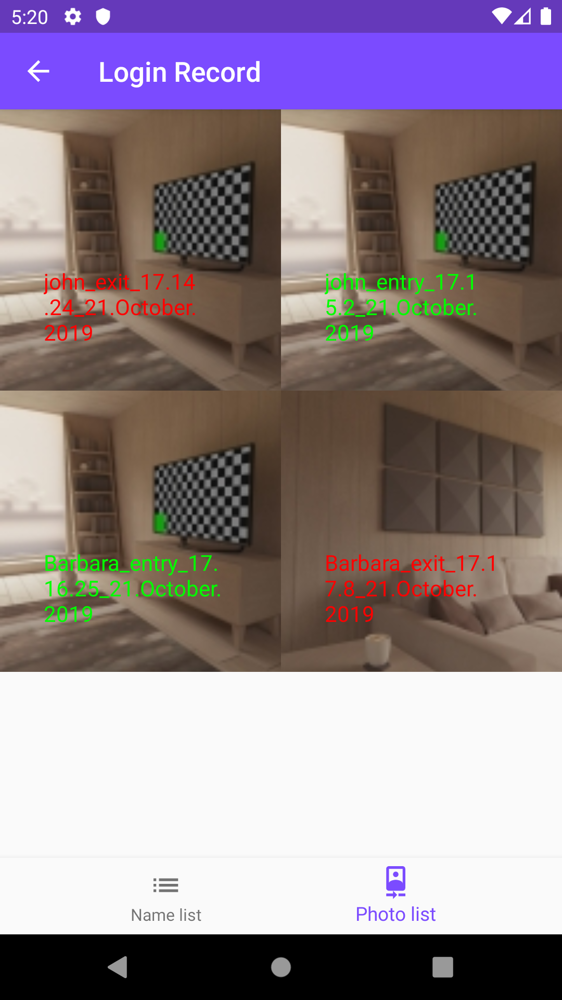

# Login Record

>Login Record is an application that records workers' entry and exit hours by selfie powered by Firebase services. It provides features like tracing comprehensive information about all entry and exit hours of workers.

## Features
  - Admin panel for employer
  - See entry & exit hours of employees as a list
  - See photos of employees as a list
  - Device orientation change support
  - Tablet supported

## Usage
##### Employee can select entry or exit and then he have to take a selfie in front of company board

##### Application has admin panel for employers

##### Detailed time and date list of employees entrance

##### Selfie list of employees

## Installation
> Change `google-services.json` with yours to built the application (integrate to Firebase)

### Dependencies
  - Firebase Realtime Database
  - Firebase Storage
  - Firebase Authentication
  - Glide

Contributing
Pull requests are welcome. For major changes, please open an issue first to discuss what you would like to change.

License
This repository is licensed under the MIT License. Please see the LICENSE file for more details.